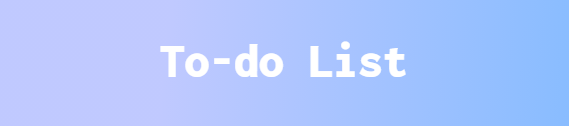
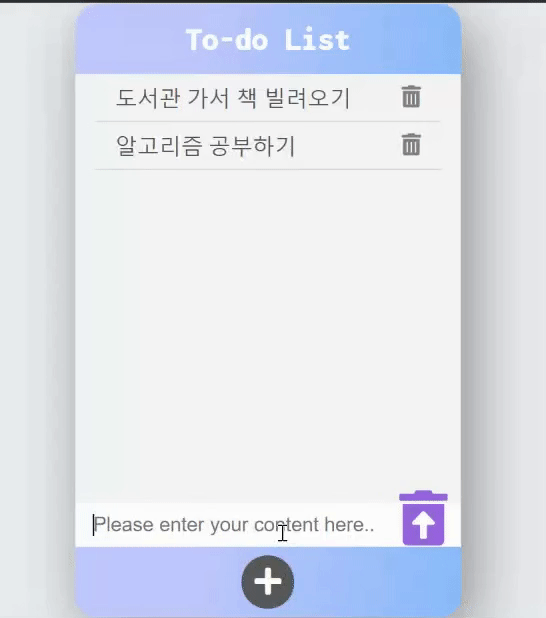
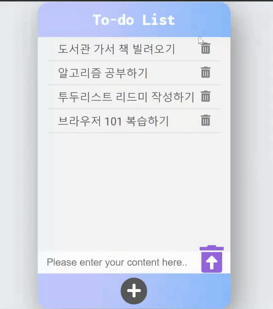
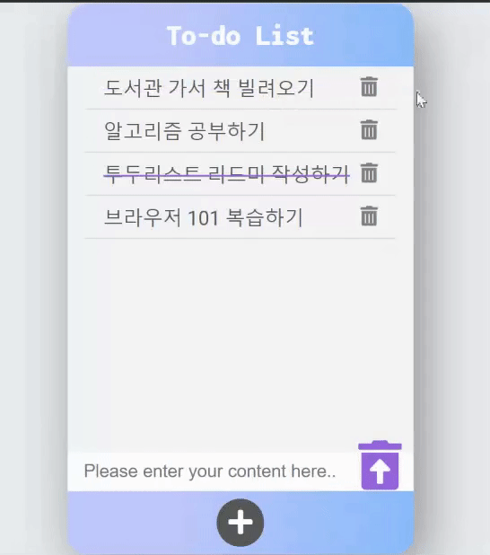
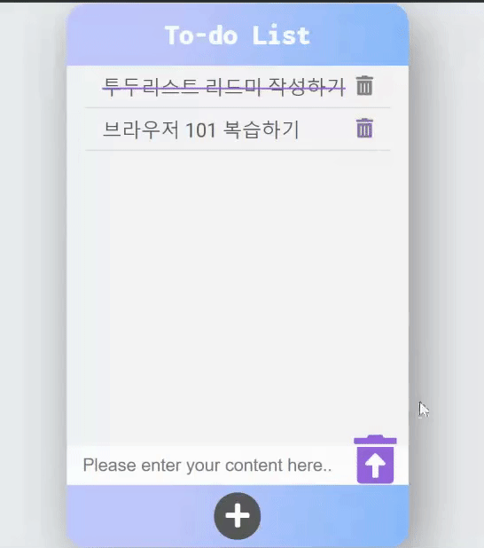
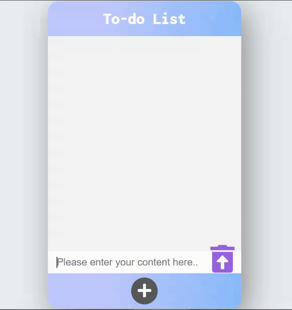

merry.github.io

<h1 align="center"><b>To-do list</b></h1>
<p align="center">


</p>
  
<h2 align="center"><a href="https://merryha.github.io/To-do-list/"><b>Live Demo</b></a></h2>

---

## **Description**

텍스트를 입력창에 입력하면 동적으로 리스트에 추가해주는 미니 프로젝트입니다.

**이 프로젝트는 드림코딩 아카데미 과정 중 하나로 디자인 및 기능을 변형/확장한 버전입니다.**

## **How to play**

### **You can add the content using the Enter key or the Add button.**



- 입력창에 내용을 입력하고 ➕모양의 버튼을 클릭하거나 Enter key를 누르세요.
- 내용이 동적으로 리스트에 추가되어 보여집니다.

### **You can strike through existing list.**



- 텍스트 구역 및 텍스트 자체를 클릭하면 선을 그을 수 있습니다.

### **Click the trash can icon!**



- 쓰레기통 아이콘을 클릭하면 추가 되었던 리스트를 삭제할 수 있습니다.

### **You can delete all the lists.**



- 하단의 쓰레기통에 마우스를 hover하면 아이콘에 대한 설명이 나타납니다.
- 쓰레기통 아이콘을 클릭하면 삭제 의사를 확인하는 팝업이 뜨고, **확인**을 누르면 모두 삭제됩니다.

### **Automatically scroll to the last list you created.**



- 리스트가 담긴 컨테이너의 높이를 넘어설만큼 리스트를 많이 추가하면 스크롤이 가능하도록 하였습니다.
- `scrollIntoView({block:'end'})`을 이용해서 자동으로 방금 생성한 리스트가 보여지도록 스크롤링합니다.

# **About the project.**

**Development Environment** : HTML, CSS, Vanilla JS, vscode, github  
자세한 코드는 [이곳](https://github.com/MerryHa/To-do-list/blob/main/main.js)에서 확인하세요.

### **Local Storage**

`Storage.getItem()`과 `Storage.setItem()` 메서드를 이용하여 브라우저가 닫히거나 다시 열리더라도 입력해 두었던 리스트 데이터들이 사라지지 않도록 구현했습니다.

```js
window.addEventListener('load', () => {
  loadItemsFromBrowser();
});
window.addEventListener('beforeunload', () => {
  saveItemsInBrowser();
});

function saveItemsInBrowser() {
  localStorage.setItem('items', items.innerHTML);
  localStorage.setItem('itemID', id);
}
function loadItemsFromBrowser() {
  const loadedItems = localStorage.getItem('items');
  const loadedID = localStorage.getItem('itemID');
  items.innerHTML = loadedItems;
  id = loadedID;
}
```

### **CSS**

텍스트 색상과 다른 색으로 strike through 되도록 하였습니다.

> 1.  텍스트를 한번 더 `span`으로 감싼다.

```html
<span class="item__name--outer">
  <span class="item__name">${text}</span>
</span>
```

> 2.  감싸진 outer에 `color`와 `text-decoration`을 적용하고 안의 text에 다른 color를 쓴다.

```css
.item__name--outer.strikethrough {
  color: var(--color-purple);
  text-decoration: line-through;
}
```

# **Future scope**

- strike through 할 때 왼쪽에서 오른쪽으로 그어지도록 하기
